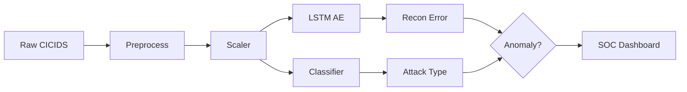

# IDS Project Improvement Guide: SOC-Ready Intrusion Detection System

A comprehensive, practical guide to elevate your IDS from a working prototype to a **professional SOC-ready** and **portfolio-worthy** system.

---

## Table of Contents
1. [Model Improvements](#1-model-improvements)
2. [SOC Dashboard Improvements](#2-soc-dashboard-improvements)
3. [Engineering & Production](#3-engineering--production-improvements)
4. [Research-Level Improvements](#4-research-level-improvements)
5. [Documentation Improvements](#5-documentation-improvements)
6. [Prioritization Roadmap](#6-prioritization-roadmap)

---

## 1. Model Improvements

### 1.1 Threshold Calibration (ROC / Optimal F1)

**Problem:** Hardcoded `0.05` fallback and manual slider don't reflect validation performance.

**Solution:** Compute threshold on **validation data** using ROC or F1 maximization, then persist it.

```python
# Add to your training notebook or create scripts/threshold_calibration.py
import numpy as np
from sklearn.metrics import roc_curve, f1_score, precision_recall_curve

def calibrate_threshold_roc(y_true, recon_errors):
    """Optimal threshold via ROC (Youden's J statistic)."""
    fpr, tpr, thresholds = roc_curve(y_true, recon_errors)
    j_scores = tpr - fpr
    best_idx = np.argmax(j_scores)
    return thresholds[best_idx]

def calibrate_threshold_f1(y_true, recon_errors):
    """Optimal threshold via max F1 on precision-recall curve."""
    prec, rec, thresholds = precision_recall_curve(y_true, recon_errors)
    f1_scores = 2 * prec * rec / (prec + rec + 1e-10)
    best_idx = np.argmax(f1_scores)
    return thresholds[best_idx] if best_idx < len(thresholds) else thresholds[-1]

# Usage after training:
# y_val_binary = (y_val != "Benign").astype(int)
# recon_errors_val = np.mean(np.square(X_val_seq - autoencoder.predict(X_val_seq)), axis=(1,2))
# best_thresh = calibrate_threshold_f1(y_val_binary, recon_errors_val)
# joblib.dump(best_thresh, "threshold.save")
```

**Action:** Add a training cell that saves `threshold.save` and `class_names.save` from your `LabelEncoder`.

---

### 1.2 Handling Severe Class Imbalance (Benign vs 30+ Attack Types)

**Strategies (in order of impact):**

| Strategy | Implementation |
|----------|----------------|
| **1. Class weights** | `model.fit(..., class_weight=compute_class_weight('balanced', classes=np.unique(y), y=y))` |
| **2. Oversampling (SMOTE)** | `from imblearn.over_sampling import SMOTE` on training set only |
| **3. Undersample Benign** | Cap Benign to 2–3× max attack class for classifier training |
| **4. Focal Loss** | Use focal loss instead of cross-entropy for hard-example focus |
| **5. Two-stage** | Binary (Benign vs Attack) → Multi-class (only on Attack samples) |

```python
# Two-stage approach (recommended for 30+ classes):
# Stage 1: Binary classifier (Benign vs Attack) - use class_weight='balanced'
# Stage 2: Attack-type classifier trained only on Attack samples (more balanced)
```

---

### 1.3 Add XGBoost / RandomForest Alongside LSTM

**Why:** Tree models excel at tabular flow features; LSTM adds sequence/temporal view. Ensemble = robustness.

```python
# Ensemble prediction: combine anomaly score + classifier votes
def hybrid_predict(features_scaled, autoencoder, xgb_clf, threshold):
    # Anomaly score (LSTM AE)
    seq = features_scaled.reshape(1, 1, -1)
    pred_ae = autoencoder.predict(seq, verbose=0)
    recon_err = np.mean(np.square(seq - pred_ae))
    is_anomaly_ae = recon_err > threshold

    # Supervised (XGBoost)
    pred_xgb = xgb_clf.predict_proba(features_scaled)[0]
    attack_prob = 1 - pred_xgb[benign_idx]
    is_anomaly_xgb = np.argmax(pred_xgb) != benign_idx

    # Hybrid: flag if EITHER detects anomaly (reduces FN)
    is_anomaly = is_anomaly_ae or is_anomaly_xgb
    return is_anomaly, pred_xgb, recon_err
```

**Action:** Save XGBoost model (`xgb_model.json`) and load it in the dashboard for ensemble mode.

---

### 1.4 Hybrid IDS: Anomaly + Supervised

**Current flow:** `recon_error > threshold` → classifier. **Issue:** Many attacks have low recon error (similar to normal).

**Improved flow:**
1. **Always** run classifier.
2. Anomaly flag = `recon_error > threshold` OR `classifier predicts attack with high confidence`.
3. Risk score = weighted combination of normalized recon error and attack probability.

```python
def hybrid_risk_score(recon_err, attack_proba, threshold, w_ae=0.4, w_clf=0.6):
    norm_err = min(recon_err / (threshold * 2), 1.0)  # cap at 1
    return w_ae * norm_err + w_clf * attack_proba
```

---

### 1.5 Reducing False Negatives

| Tactic | Implementation |
|--------|----------------|
| Lower threshold | Use F1-optimal threshold (usually lower than ROC-Youden) |
| Ensemble OR logic | Flag if AE **or** classifier says attack |
| Per-class thresholds | Different threshold per attack family (advanced) |
| Confidence threshold | If classifier attack prob > 0.7, flag even if recon low |
| Cost-sensitive learning | Penalize FN more than FP in loss/weights |

---

### 1.6 LSTM Autoencoder Architecture Tuning

**Goal:** Better separation of normal vs attack reconstruction errors.

- **Bottleneck:** Reduce latent dim (e.g., 64 instead of 128) to force stronger compression.
- **Depth:** Add another LSTM layer in encoder/decoder.
- **Regularization:** Add `activity_regularizer=l1(1e-5)` or Dropout(0.2).
- **Train on mixed data (controversial):** Include a small % of attacks to teach "attack = high error" (optional).

```python
# Improved LSTM AE architecture
inputs = Input(shape=(timesteps, n_features))
x = LSTM(64, activation='tanh', return_sequences=False, 
         activity_regularizer=l1(1e-5))(inputs)  # smaller bottleneck
x = RepeatVector(timesteps)(x)
x = LSTM(64, activation='tanh', return_sequences=True)(x)
outputs = TimeDistributed(Dense(n_features))(x)
```

---

### 1.7 Reconstruction Error Distribution Visualization

```python
import seaborn as sns

def plot_recon_distribution(errors_normal, errors_attack, threshold):
    fig, ax = plt.subplots(figsize=(10, 4))
    sns.histplot(errors_normal, bins=50, label='Normal', alpha=0.6, color='green', kde=True, ax=ax)
    sns.histplot(errors_attack, bins=50, label='Attack', alpha=0.6, color='red', kde=True, ax=ax)
    ax.axvline(threshold, color='black', linestyle='--', label=f'Threshold={threshold:.4f}')
    ax.set_xlabel('Reconstruction Error (MSE)')
    ax.set_ylabel('Count')
    ax.set_title('Reconstruction Error Distribution: Normal vs Attack')
    ax.legend()
    return fig
```

---

### 1.8 Severity Scoring Instead of Binary Flag

```python
def compute_severity(recon_err, attack_proba, attack_type):
    # Base score from reconstruction error (0-1)
    norm_err = np.clip(recon_err / (threshold * 3), 0, 1)
    # Combine with classifier confidence
    score = 0.5 * norm_err + 0.5 * attack_proba
    # Map attack types to severity multiplier (e.g., DDoS=1.0, Infiltration=0.8)
    severity_map = {"DDoS": 1.0, "Botnet": 0.95, "Bruteforce": 0.9, ...}
    mult = severity_map.get(attack_type, 0.7)
    return np.clip(score * mult, 0, 1)

# Severity levels
def severity_level(score):
    if score >= 0.8: return "Critical"
    if score >= 0.6: return "High"
    if score >= 0.4: return "Medium"
    return "Low"
```

---

## 2. SOC Dashboard Improvements

### 2.1 Severity Levels (Low / Medium / High / Critical)

```python
SEVERITY_COLORS = {"Critical": "#dc3545", "High": "#fd7e14", "Medium": "#ffc107", "Low": "#28a745"}

def render_alert_badge(severity):
    color = SEVERITY_COLORS.get(severity, "#6c757d")
    st.markdown(f'<span style="background:{color};color:white;padding:4px 8px;border-radius:4px">{severity}</span>',
                unsafe_allow_html=True)
```

### 2.2 Attack Frequency Chart

```python
import plotly.express as px

# df_history with 'result' column containing attack type
attack_counts = df_history[df_history['alert']]['result'].value_counts()
fig = px.bar(x=attack_counts.index, y=attack_counts.values, 
             title="Top Attack Types", labels={'x':'Attack Type','y':'Count'})
st.plotly_chart(fig)
```

### 2.3 Timeline Graph

```python
df_history['datetime'] = pd.to_datetime(df_history['time'], format='%H:%M:%S')
fig = px.line(df_history, x='datetime', y='error', color='alert',
              title='Reconstruction Error Timeline')
fig.add_hline(y=threshold, line_dash="dash")
st.plotly_chart(fig)
```

### 2.4 Top Attack Types Chart

Same as 2.2; use horizontal bar for readability.

### 2.5 Risk Score Indicator

```python
st.metric("Risk Score", f"{risk_score:.0%}", delta=None)
# Progress bar
st.progress(risk_score)
```

### 2.6 Feature Importance / Explainability

```python
# For XGBoost (if you add it)
import matplotlib.pyplot as plt
xgb_clf = joblib.load("xgb_model.save")
imp = pd.Series(xgb_clf.feature_importance_in_tree(), index=feature_names)
imp.sort_values(ascending=True).tail(15).plot(kind='barh')
st.pyplot(plt.gcf())
```

### 2.7 Alert Prioritization

Sort alerts by `severity_score` descending, then by `time` descending. Show Critical first.

### 2.8 Real-Time Stream Simulation

```python
# Simulate streaming: read CSV in chunks, predict each row
def stream_simulation(uploaded_file, chunk_size=10):
    for chunk in pd.read_csv(uploaded_file, chunksize=chunk_size):
        for _, row in chunk.iterrows():
            pred = run_prediction(row.values)
            yield pred
```

Use `st.empty()` + loop with `time.sleep(0.5)` for animation effect.

### 2.9 CSV Log Ingestion Improvements

- Support **multiple CSV columns** (auto-detect feature columns via `feature_names`).
- Handle missing columns: fill with 0 or median.
- Validate schema before processing.

```python
def load_csv_smart(uploaded_file, expected_features):
    df = pd.read_csv(uploaded_file)
    missing = set(expected_features) - set(df.columns)
    if missing:
        st.warning(f"Missing columns (filled with 0): {missing}")
        for c in missing:
            df[c] = 0
    return df[expected_features]
```

### 2.10 Export Alerts to CSV

```python
alerts_df = pd.DataFrame([h for h in st.session_state.history if h["alert"]])
if st.button("Export Alerts"):
    alerts_df.to_csv("alerts_export.csv", index=False)
    st.download_button("Download alerts_export.csv", data=alerts_df.to_csv(index=False),
                       file_name="alerts.csv", mime="text/csv")
```

---

## 3. Engineering & Production Improvements

### 3.1 Modular Repository Structure

```
ids/
├── config/
│   └── config.yaml          # paths, model params, thresholds
├── src/
│   ├── __init__.py
│   ├── models/
│   │   ├── __init__.py
│   │   ├── autoencoder.py
│   │   ├── classifier.py
│   │   └── ensemble.py
│   ├── preprocessing/
│   │   ├── __init__.py
│   │   └── pipeline.py
│   ├── inference/
│   │   ├── __init__.py
│   │   └── predictor.py
│   └── utils/
│       ├── __init__.py
│       ├── logging_config.py
│       └── metrics.py
├── app/
│   ├── __init__.py
│   └── dashboard.py         # Streamlit app
├── scripts/
│   ├── train.py
│   ├── evaluate.py
│   └── calibrate_threshold.py
├── models/                   # .gitignore except README
│   ├── lstm_autoencoder.keras
│   ├── attack_classifier.keras
│   ├── scaler.save
│   └── threshold.save
├── tests/
│   └── test_predictor.py
├── .github/workflows/
│   └── ci.yml
├── requirements.txt
├── requirements-dev.txt
└── README.md
```

### 3.2 Logging System

```python
# src/utils/logging_config.py
import logging
import sys

def setup_logging(level=logging.INFO):
    logging.basicConfig(
        level=level,
        format="%(asctime)s | %(levelname)s | %(name)s | %(message)s",
        handlers=[logging.StreamHandler(sys.stdout)]
    )
    return logging.getLogger("ids")
```

### 3.3 Configuration File

```yaml
# config/config.yaml
paths:
  models_dir: models
  data_dir: data

models:
  autoencoder:
    latent_dim: 64
    epochs: 20
  classifier:
    num_classes: 33

threshold:
  method: f1  # or roc
  default: 0.05

dashboard:
  auto_refresh_sec: 5
  max_history: 1000
```

```python
# Load config
import yaml
with open("config/config.yaml") as f:
    config = yaml.safe_load(f)
```

### 3.4 CI/CD (GitHub Actions)

```yaml
# .github/workflows/ci.yml
name: CI
on: [push, pull_request]
jobs:
  test:
    runs-on: ubuntu-latest
    steps:
      - uses: actions/checkout@v4
      - uses: actions/setup-python@v5
        with:
          python-version: "3.10"
      - run: pip install -r requirements.txt
      - run: python -m pytest tests/ -v
```

### 3.5 Automated Model Evaluation Script

```python
# scripts/evaluate.py
def evaluate_models(models_dir, test_csv_path):
    """Run evaluation and output metrics JSON."""
    # Load models, test data
    # Compute: accuracy, F1, precision, recall, ROC-AUC, PR-AUC
    # Save to evaluation_report.json
```

### 3.6 Improved requirements.txt

```
# Core
streamlit>=1.28.0
tensorflow>=2.15.0
scikit-learn>=1.3.0
joblib>=1.3.0
numpy>=1.24.0
pandas>=2.0.0
matplotlib>=3.7.0

# Dashboard & viz
plotly>=5.18.0
seaborn>=0.13.0

# Training (optional)
xgboost>=2.0.0
imbalanced-learn>=0.11.0

# Config & utils
pyyaml>=6.0.0
```

### 3.7 Scalability

- **Batch prediction:** Process CSV in chunks (e.g., 1000 rows) for large uploads.
- **Async:** Use `st.spinner` during heavy inference.
- **Model caching:** `@st.cache_resource` already used; ensure it's not cleared unnecessarily.

---

## 4. Research-Level Improvements

### 4.1 Adversarial Robustness Testing

- Generate adversarial samples (e.g., FGSM on input features) and measure drop in detection rate.
- Report: "Detection rate under ε=0.01 perturbation: X%".

### 4.2 Explainable AI (SHAP/LIME)

```python
import shap

# For tree model (XGBoost)
explainer = shap.TreeExplainer(xgb_clf, X_background)
shap_values = explainer.shap_values(single_sample)
shap.waterfall_plot(shap_values[0], single_sample, feature_names=feature_names)
```

### 4.3 Ensemble Models

- Combine LSTM AE anomaly score + XGBoost proba + Dense NN proba via weighted average or stacking.

### 4.4 Model Comparison Report

| Model | Accuracy | F1 (macro) | ROC-AUC | Inference (ms) |
|-------|----------|------------|---------|----------------|
| LSTM AE + threshold | - | - | - | - |
| Dense NN | - | - | - | - |
| XGBoost | - | - | - | - |
| Hybrid | - | - | - | - |

### 4.5 Precision-Recall Curves

```python
from sklearn.metrics import precision_recall_curve, average_precision_score
precision, recall, _ = precision_recall_curve(y_true, y_scores)
ap = average_precision_score(y_true, y_scores)
plt.plot(recall, precision, label=f'AP={ap:.3f}')
```

### 4.6 Attack Confusion Matrix Visualization

```python
import seaborn as sns
from sklearn.metrics import confusion_matrix
cm = confusion_matrix(y_true, y_pred, labels=class_names)
sns.heatmap(cm, xticklabels=class_names, yticklabels=class_names, annot=True, fmt='d')
```

### 4.7 Feature Selection Techniques

- Mutual Information, Random Forest feature importance, SHAP.
- Retrain with top-K features to reduce overfitting and speed.

### 4.8 Concept Drift Handling

- Monitor distribution of incoming features vs training distribution (e.g., KL divergence).
- Trigger retraining or threshold recalibration when drift detected.

---

## 5. Documentation Improvements

### 5.1 Professional README Structure

```markdown
# IDS: Intrusion Detection System

[Badges: CI, License, Python]

## Overview
One-paragraph description.

## Architecture
- Diagram (Mermaid or image)
- Data flow: CICIDS → Preprocess → LSTM AE + Classifier → Dashboard

## Dataset
- CICIDS 2017/2018, 9M+ flows, 78 features, 33 classes
- Link, citation

## Installation
...

## Usage
- Training
- Dashboard
- Evaluation

## Evaluation Metrics
- Precision, Recall, F1, ROC-AUC, PR-AUC
- Confusion matrix

## Limitations & Future Work
- Synthetic/lab data; real-world deployment considerations
- Planned: concept drift, SHAP integration

## SOC Workflow
- How analysts use the dashboard (triage → investigate → export)

## License
```

### 5.2 Architecture Diagram (Mermaid)



### 5.3 Limitations and Future Work

- Dataset is synthetic; may not generalize to real traffic.
- No encrypted traffic analysis.
- Single threshold for all attack types.
- Future: online learning, drift detection, SHAP integration.

---

## 6. Prioritization Roadmap

### Phase 1 (Quick Wins, 1–2 days)
1. Calibrate and save `threshold.save` + `class_names.save` in training.
2. Fix dashboard to load real class names.
3. Add severity levels and risk score to dashboard.
4. Export alerts to CSV.

### Phase 2 (Model & UX, 3–5 days)
5. Add XGBoost to ensemble; save and load in app.
6. Implement hybrid risk score.
7. Top attack types + timeline charts (Plotly).
8. Improve CSV ingestion (missing columns, validation).

### Phase 3 (Engineering, 1 week)
9. Modularize repo (src/, config/, scripts/).
10. Add config.yaml and logging.
11. CI with pytest.
12. Automated evaluation script.

### Phase 4 (Research & Polish, 1–2 weeks)
13. SHAP/LIME explainability.
14. Precision-Recall curves and confusion matrix.
15. Professional README and architecture diagram.
16. Adversarial robustness experiments (optional).

---

## Summary

Your IDS has a solid foundation. The highest-impact improvements are:

1. **Threshold calibration** and **class names** from training.
2. **Hybrid anomaly + classifier** with risk scoring.
3. **SOC-style dashboard** (severity, charts, export).
4. **Modular structure** and **CI** for professionalism.
5. **Explainability** and **evaluation report** for portfolio/research appeal.

Implement Phase 1 first, then iterate based on your timeline and goals.
